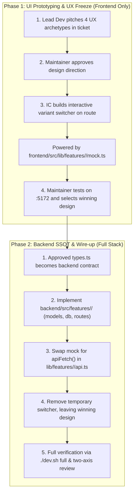

# AGENTS.md — CoSave Engineering Standards & Operating Manual

This document defines the engineering standards, architecture, and autonomous development workflow for **CoSave**. All contributors and AI agents must adhere strictly to these rules.

---

## 1. Tech Stack

- **Backend**: Rust 1.98+ (Axum 0.8, Tokio 1.53, Tower-HTTP 0.7, Serde 1.0, SQLx 0.8 / SQLite, Argon2 0.5)
- **Frontend**: SvelteKit 2 + Svelte 5 (runes mode: `$state`, `$derived`, `$effect`, `$props`), Vite 8, Tailwind CSS v4 (`@tailwindcss/vite`), shadcn-svelte, `@sveltejs/adapter-static` (SPA fallback)
- **Package Manager**: `pnpm` (never `npm` or `npx` for package management)
- **Containerization**: Multi-stage Dockerfile (`node:24-alpine` -> `rust:alpine` -> `alpine:3.21`)
- **Workflow Automation**: [`./dev.sh`](./dev.sh)

---

## 2. Core Architecture: Feature-First & The Two-Phase Lifecycle

The Rust backend is the authoritative **Single Source of Truth (SSOT)** for data, validation, and domain calculations. The frontend is a reactive presentation-layer mirror.

To avoid bloated, tangled monolithic pull requests and ensure best-in-class UX, feature development strictly follows a **Two-Phase Lifecycle**:



### Phase 1: UI Prototyping & UX Freeze (Frontend Only)
1. **Design Pitch**: The Lead Developer reviews the feature goal and posts a comment on the ticket proposing **4 distinct UX design archetypes** (e.g. Apple Settings/Cards, Interactive Master-Detail, Visual Tree/Graph, Dense Financial Cockpit).
2. **Human Approval**: The maintainer reviews the pitch, provides directional feedback, and approves construction.
3. **Interactive Prototype Switcher**:
   - An IC agent creates a ticket branch (`feat/<feature>-ui-prototype`).
   - The IC builds an interactive sticky switcher at the top of the route (e.g. `/configuration/family`), allowing instant switching between the 4 prototype layouts.
   - All prototypes are powered by mock data in `frontend/src/lib/features/<feature>/mock.ts` and typed in `types.ts`.
   - **Zero Backend Code**: No SQLite tables, Rust models, or backend routes are created in Phase 1.
   - Run `./dev.sh ui check` and open a PR into `feature/<feature>`.
4. **UX Freeze & Winner Selection**: The maintainer tests the prototypes in the browser at `http://localhost:5172` and comments on the ticket designating the winning variant.

### Phase 2: Backend Implementation & Wire-up (Backend SSOT)
1. **Contract Handoff**: The frozen `frontend/src/lib/features/<feature>/types.ts` serves as the authoritative contract for the backend.
2. **Feature-First Backend**:
   - Create `feat/<feature>-backend`.
   - **Models**: Implement Serde structs in `backend/src/features/<feature>/models.rs` matching `types.ts` 1:1.
   - **Database**: Implement queries and schema in `backend/src/features/<feature>/db.rs`. Zero SQL in routes!
   - **Routes**: Implement thin Axum handlers in `backend/src/features/<feature>/routes.rs`.
   - **Mount**: Mount the router in `backend/src/features/<feature>/mod.rs` and register in `main.rs`.
3. **Frontend Integration**:
   - In `frontend/src/lib/features/<feature>/api.ts`, replace the mock return with `apiFetch<T>()`.
   - Remove the temporary variant switcher and obsolete mock prototypes from the route page, leaving only the winning design.
4. **Full Verification**: Run `./dev.sh full`, ensure all checks and tests pass, and submit PR to `feature/<feature>`.
5. **Final Delivery**: Lead Developer conducts a two-axis `/code-review`. Once merged, a master PR into `main` is opened for final human sign-off.

---

## 3. Backend Standards (Rust & Axum)

### Feature-First Directory Layout
All backend code is organized into cohesive feature modules:

```
backend/src/
├── core/                       # Cross-cutting infrastructure & shared utilities
│   ├── db.rs                   # Connection pool setup, schema bootstrap
│   ├── error.rs                # AppError enum and IntoResponse
│   ├── response.rs             # ApiResponse<T>, Code, Status enums
│   └── state.rs                # AppState definition
├── features/                   # Domain features (self-contained)
│   ├── auth/                   # Authentication & sessions
│   │   ├── mod.rs              # Router export
│   │   ├── db.rs               # SQL queries for users & sessions
│   │   ├── models.rs           # Request/response DTOs & user structs
│   │   └── routes.rs           # Axum HTTP handlers
│   └── family/                 # Family & accounts feature
│       ├── mod.rs              # Router export (pub(crate) fn router() -> Router<AppState>)
│       ├── db.rs               # SQL queries & DB functions
│       ├── models.rs           # Serde structs mirroring frontend types.ts
│       └── routes.rs           # Thin Axum handlers
└── main.rs                     # Server bootstrap, CLI parsing, and router assembly
```

### The Zero-SQL-in-Routes Rule
- **`routes.rs`**: Strictly limited to HTTP concerns (extracting path/JSON, checking auth, calling `db.rs`, returning `ApiResponse<T>`). Route handlers must **NEVER** contain raw `sqlx::query` or direct database statements.
- **`db.rs`**: The **ONLY** file within a feature permitted to run SQL queries, manage transactions, and map database rows.

### Visibility & Safety
- **Default to Private**: Start with private visibility for all items. Elevate to `pub(crate)` only when an item must be accessed by other modules in the crate. Never use `pub` unless required by an external trait boundary.
- **API Envelope**: All REST responses must use the standardized `ApiResponse<T>` envelope with typed `Code` and `Status` enums:
  ```rust
  pub(crate) struct ApiResponse<T: Serialize> {
      pub(crate) code: Code,
      pub(crate) status: Status,
      pub(crate) data: T,
  }
  ```
- **Passwords & Auth**: Passwords hashed exclusively via Argon2id with random salts. Never log or return raw credentials.

---

## 4. Frontend Standards (SvelteKit 2, Svelte 5 & Tailwind v4)

### Feature-First Directory Layout
Frontend feature code strictly mirrors the backend feature structure:

```
frontend/src/lib/
├── components/
│   └── ui/                     # Official shadcn-svelte primitives ONLY (IMMUTABLE)
├── features/                   # Domain features (self-contained)
│   └── family/                 # Family & accounts feature
│       ├── components/         # Feature components (MemberCard.svelte, AccountRow.svelte)
│       ├── api.ts              # Typed apiFetch calls for this feature
│       ├── types.ts            # TypeScript interfaces matching backend models.rs
│       └── mock.ts             # Prototype mock data for Phase 1
└── ...                         # Shared stores (theme.ts, health.ts)
```

### UI Primitives & shadcn-svelte Rules
1. **Never Hand-Craft or Edit Primitives**:
   - Files in `frontend/src/lib/components/ui/` are official upstream primitives. **Never manually write, edit, or copy files inside this folder.**
   - All primitives must be installed strictly using the CLI:
     ```bash
     ./dev.sh ui shadcn <component>
     # Or: cd frontend && pnpm dlx shadcn-svelte@latest add -y <component>
     ```
   - Build application components inside `frontend/src/lib/features/<feature>/components/` and compose the untouched primitives from `$lib/components/ui/*`.

### Dev-Mode Mock Session (No Auth Walls During Prototyping)
- In development mode (`DEV=true`), SvelteKit's session state defaults to an active mock admin user.
- Feature routes under exploration (e.g. `/configuration/family`) must **never** be blocked by login walls during prototyping.

### TypeScript & Styling
- **Strict Typing**: Zero `any`. Use `unknown` with runtime guards. Prefer `null` over `undefined` for empty state.
- **Tailwind v4 Canonical Syntax**:
  - Use `border-(--border-subtle)` instead of bracket syntax `border-[var(--...)]`.
  - Use `size-8` shorthand.
  - Adhere to the established Apple/OLED dark theme tokens (`#000000` base, subtle borders, generous spacing).
- **Bundle Budget**: Heavy dependencies (such as Apache ECharts) must be imported from deep subpaths (e.g. `echarts/lib/chart/sankey/install.js`) and code-split dynamically to stay strictly below the 500 kB chunk limit.

---

## 5. Tooling & Dependency Management

**Strict Requirement**: Always use official CLI package tools. Never manually edit `package.json` or `Cargo.toml` to add dependencies:

```bash
# Add frontend package
./dev.sh ui add <package-name>

# Add backend crate
./dev.sh backend add <crate-name>

# Add shadcn component
./dev.sh ui shadcn <component-name>
```

---

## 6. Development & CI Workflow (`./dev.sh`)

Always use [`./dev.sh`](./dev.sh) for standard workflows instead of running raw `cargo` or `pnpm` commands:

- `./dev.sh dev` — Concurrently starts backend (`:5171`) and frontend (`:5172`) with live reload.
- `./dev.sh fbuild` — Fast build pipeline: check -> flint (auto-fixes) -> build.
- `./dev.sh full` — Full verification pipeline: test -> check -> build -> flint.
- `./dev.sh flint` — Auto-formats and lints both backend and frontend.
- `./dev.sh check` — Runs `cargo check` and `svelte-check`.
- `./dev.sh test` — Runs cargo unit tests, Vitest, and container validation.
- `./dev.sh doctor` — Verifies Rust, Cargo, Node, pnpm, Docker, and dev port availability.

---

## 7. Agent Skills & Issue Tracking

The autonomous squad reads the following project specifications for agent skills:
- **Issue Tracker**: [`docs/agents/issue-tracker.md`](docs/agents/issue-tracker.md) (GitHub Issues + Multica)
- **Triage Vocabulary**: [`docs/agents/triage-labels.md`](docs/agents/triage-labels.md)
- **Domain Consumer Rules**: [`docs/agents/domain.md`](docs/agents/domain.md)

---

## 8. Don'ts

- **Don't** write backend code, migrations, or database tables during Phase 1 (UI Prototyping).
- **Don't** write raw SQL queries or database calls inside route handlers; all SQL belongs in `db.rs`.
- **Don't** hand-create, edit, or modify any file in `frontend/src/lib/components/ui/`; install primitives only via `./dev.sh ui shadcn <comp>`.
- **Don't** manually edit `Cargo.toml` or `package.json` to add dependencies; use `./dev.sh backend add` or `./dev.sh ui add`.
- **Don't** implement business logic, financial calculations, or state authority on the frontend.
- **Don't** introduce `any` types in TypeScript.
- **Don't** use arbitrary bracket syntax `[var(--...)]` in Tailwind v4; use canonical parentheses `(--...)`.
- **Don't** mark struct fields `pub` if `pub(crate)` or private visibility suffices.
- **Don't** create monolithic 40-file pull requests; separate UI prototypes from backend implementation.
